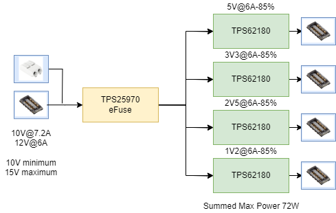
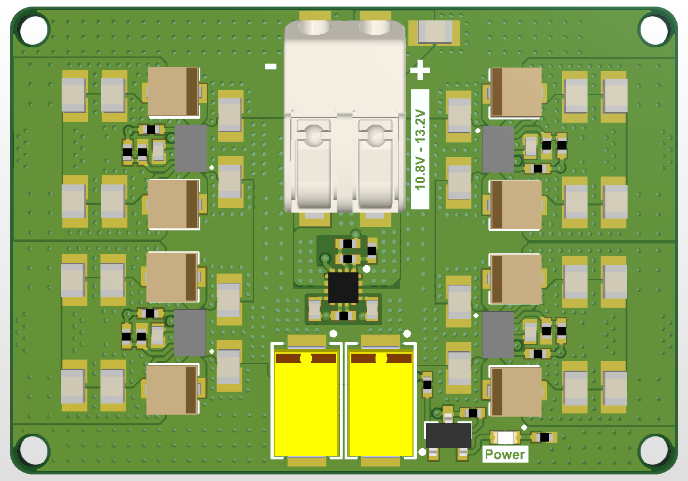
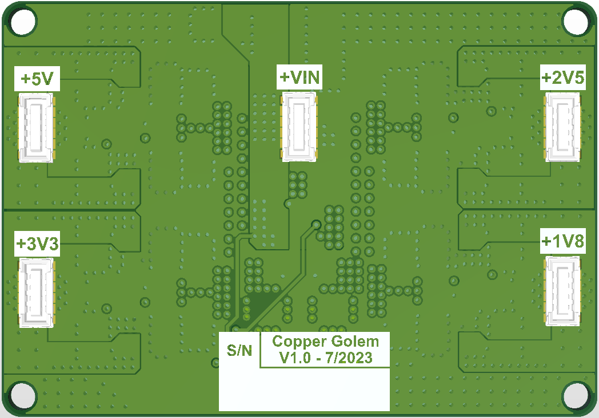

# PowerModule
## Main Components
### **TPS25970**
- Power supply: 10.8V - 13.2V (with UVLO and OVLO)
- Overcurrent protection: 7.7A

### **TPS62180**
- Used for 1.8V; 2.5V; 3.3V; 5V; output
- BGA package
- 6A maximum output

### **2074190081**

## Block Diagram

## PCB Views

## Layers
Top Layer

2nd Layer

3rd Layer

Bottom Layer

## Power Analysis

The biggest concentration of current is with the eFuse. 
Only one of the regulators (the highest power one) was simulated, as others have the same layout and will have lower consumption than the 5V; 6A regulator. 